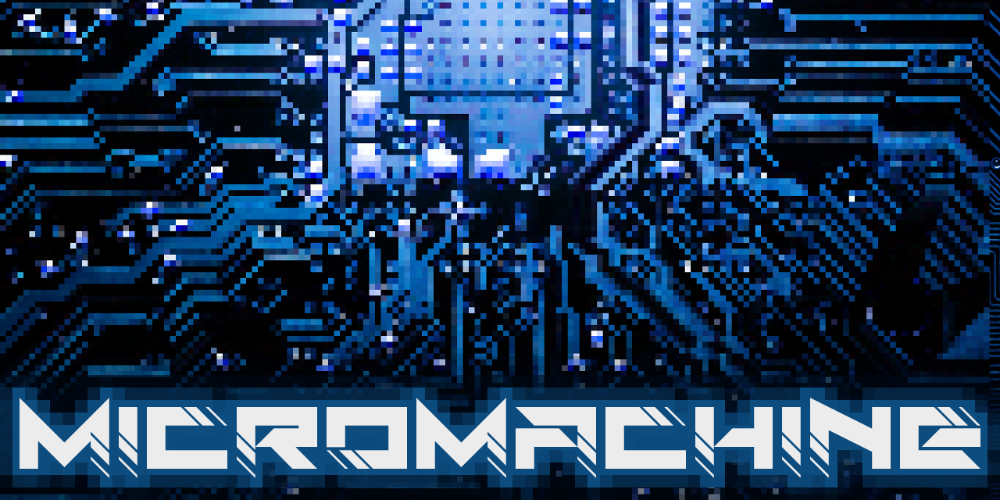

  

    

    
    
    

 

Micromachine aims to offer a correct, clean and fast (in that order) cycle-<b>inaccurate</b> armv6-m emulator capable of running application initially targeting Cortex-M0 micro-controllers.

***

### Howto

Check out [the wiki](https://github.com/flavioroth/micromachine/wiki).

### Acknowledgments
* Thanks to [jjungo](https://github.com/jjungo) for his contribution!
* [cotire](https://github.com/sakra/cotire) by Sascha Kratky
* [CPPurses](https://github.com/a-n-t-h-o-n-y/CPPurses) by a-n-t-h-o-n-y
* [ELFIO](https://github.com/serge1/ELFIO) by Serge Lamikhov
* [libaeabi-cortexm0](https://github.com/bobbl/libaeabi-cortexm0) by
  Jörg Mische
* [googletest](https://github.com/google/googletest) by Google
* [cxxopts](https://github.com/jarro2783/cxxopts) by Jarryd Beck

### Copyright
Copyright (C) 2017-2020 Flavio Roth - All Rights Reserved

